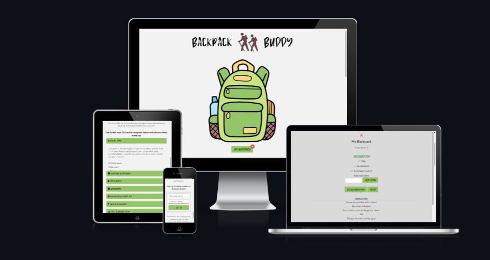
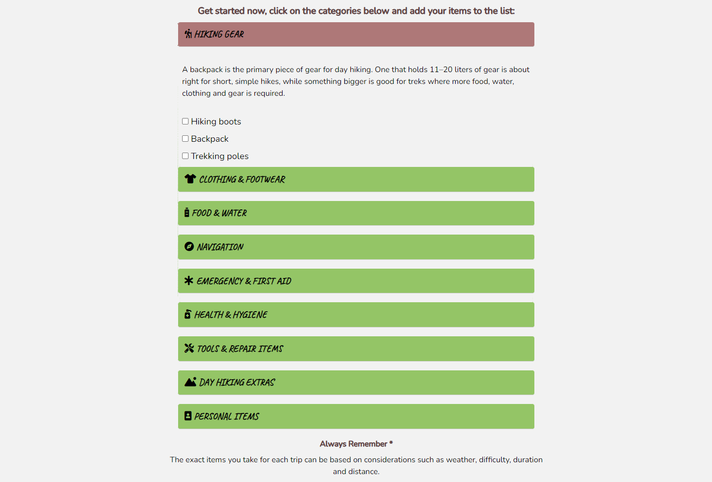

# Backpack Buddy

## Porfolio 2

Backpack Buddy is a website designed for hikers to help them prepare for their adventures. With Backpack Buddy, hikers can create a customized list of items they need to bring on their trip, ensuring they don't forget any essential items. Whether it's a day hike or a multi-day trek, Backpack Buddy can help hikers plan and prepare for their journey with ease.

# Contents

* [**User Experience UX**](<#user-experience-ux>)
    * [Wireframes](<#wireframes>)
    * [Site Structure](<#site-structure>)
    * [Design Choices](<#design-choices>)
    * [Typography](<#typography>)
    * [Colour Scheme](<#colour-scheme>)
* [**Features**](<#features>)
    * [**Home**](<#home>)
        * [Navigation](<#navigation>)
        * [Main Image Section](<#main-image-section>)
        * [Accordion Section](<#accordion-section>)
        * [Email Sign Up and Footer Section](#email-sign-up-and-footer-section)
        * [Backpack Modal](<#backpack-modal>)
        * [Sign-Up Alert Modal](<#sign-up-alert-modal>)
    * [**Error 404**](<#error-404>)
    * [**Future Features**](<#future-features>)
* [**Technologies Used**](<#technologies-used>)
* [**Testing**](<#testing>)
* [**Deployment**](<#deployment>)
* [**Credits**](<#credits>)
    * [**Content**](<#content>)
    * [**Media**](<#media>)
*  [**Acknowledgements**](<#acknowledgements>)

# User Experience (UX)

[Back to top](<#contents>)

## Wireframes

The wireframes for the website were produced in [Balsamiq](https://balsamiq.com). The frames shown below have resolution of 1024px width on left and right side, as it looks the same on smaller devices. The final site varies slightly from the wireframes due to developments that occured during the creation process. 

[Back to top](<#contents>)

## Site Structure

The website has two pages only. The [home page](index.html) is the default loading page and has additional modals and alert boxes that appear when the user interacts with the website. [404](404.html) page is for when a user visits a page that does not exist and is presented with Error page.

[Back to top](<#contents>)
## Design Choices

 * ### Typography
    The fonts chosen were 'Caveat' for the buttons and 'Nunito' for the body text. They fall back to sans-serif and cursive respectively. 
    *  'Caveat' was chosen for the buttons to give the user an adventure feel.
    *  'Nunito' is used for the body text as it goes along nicely with the rest of the font whilst being easy to read for all.

 * ### Colour Scheme
      The colour scheme eventually chosen is one based on green, lime green, black and brown. The colour contrasts with the main backpack image. Green traditionally gives the impression of nature and outdoors. Users visiting the website should sense the feeling of adventure.

[Back to top](<#contents>)

## Features 

Backpack Buddy is a comprehensive hiking website that offers a wide range of features to help hikers prepare for their adventure. The website includes a customizable checklist of essential items that hikers can add to their backpack, ensuring they have everything they need for their trip. Users can easily add or remove items from the checklist as needed, and the website also allows them to save and print the list for future reference. With Backpack Buddy, hikers can rest assured that they have all the necessary gear for a safe and enjoyable hiking experience.

# Home

## Existing Features

### Navigation

  - Features a minimalist navigation that includes only a logo, making it easy for users to focus on creating their customized hiking checklist without any distractions.
  - The logo, which is the only element in the navigation, represents the brand's commitment to providing a streamlined and intuitive user experience.

[Back to top](<#contents>)

## Main Image Section
  
  - This section is designed to grab the user's attention and create an immediate connection to the hiking experience. The section features a high-quality image of a backpack that contrasts with the color of the website, creating a visually striking effect.
  - The button features an item counter icon, which is a useful and interactive feature for users. The item counter updates in real-time as the user checks off items from their hiking checklist, providing them with a sense of progress and accomplishment as they prepare for their adventure. This feature also allows users to easily track the number of items they have added to their list and ensure that they have everything they need for their trip..

[Back to top](<#contents>)

## Accordion Section

  - This section features a collapsed list of items that users can expand to see more details about each item. This allows users to quickly and easily browse the list and add or remove items as needed. The accordion style also helps to reduce clutter on the website, making it easier for users to navigate and find the items they need. Additionally, the ability to collapse and expand items in the Accordion Section provides users with a sense of control and customization, allowing them to tailor their hiking checklist to their specific needs and preferences.

  - The ease effect used in the Accordion Section is a valuable feature that enhances the user experience. The ease effect adds a smooth animation when the user expands or collapses items in the accordion list, providing a visual cue that helps users understand the interaction between the elements on the page.

[Back to top](<#contents>)

## Email Sign Up and Footer Section

  - This is designed to encourage users to stay connected with the website and receive updates on new features and content.

  - When a user submits their name & email address, they are presented with an alert box that includes a personalized thank you message with their name included. This personalized touch creates a sense of warmth and connection between the user and the website, making them feel appreciated and valued.

  - The bottom footer includes a disclaimer and copyright text at the bottom of the page. The disclaimer provides legal information about the website's terms of use, while the copyright text indicates that the website's content is protected by copyright laws. These elements are important for protecting the website owner's rights and providing legal information to users.

[Back to top](<#contents>)

## Backpack Modal

  - This feature in shows users a summary of the items they have selected for their hiking trip. It opens when the user clicks on a button or the main image and allows them to review and edit their selections before finalizing their backpack contents.

  - Users can see a total count of the items they have selected and a check icon next to each item. This helps users track their progress and visually confirms their selected items.

  - Add Extra item feature that allows users to add custom items to their backpack, in addition to the pre-populated list. This feature enables users to personalize their backpack contents and ensures that they don't forget any important items.

  - Backpack Buddy also includes a feature that allows users to clear their entire backpack and start over, if needed. Additionally, users have the option to print their backpack checklist for easy reference on their hiking trip. These features add convenience and flexibility to the user experience, allowing users to easily adjust their backpack contents and access their checklist in a variety of ways.

[Back to top](<#contents>)

## Sign-Up Alert Modal

  - This modal that is displayed after a user submits their name & email address through the form. This modal displays a personalized thank you message that includes the user's name, adding a friendly touch to the user experience.

  - It also includes a background blur effect, which enhances the user experience by focusing the user's attention on the modal content and creating a more immersive experience. This effect adds a layer of visual interest and sophistication to the user interface, making the sign-up process feel more polished and professional..

[Back to top](<#contents>)

## Error 404

  - Error404 page includes a fun GIF image to entertain users when they visit a non-existent webpage. The page also provides users with a button to go back or it will automatically redirect them back to the homepage after 15 seconds. This feature enhances the user experience by providing users with a visually appealing and enjoyable error page, and by ensuring that users are not left stranded on a dead-end page.

[Back to top](<#contents>)

### Future Features

- Print to PDF
  - A feature for Backpack Buddy would be a "print to PDF" function, which would allow users to easily save their backpack checklist as a PDF document. This feature would add convenience and flexibility to the user experience, enabling users to access their backpack checklist in a variety of formats and easily share it with others. A "print to PDF" function would be a valuable addition to Backpack Buddy, as it would make the backpack checklist more versatile and easier to use for a wider range of users.

- Weather Widget
  - Another future feature could be a live weather widget that displays the current weather conditions for a user's desired hiking location. This feature would enhance the user experience by providing users with up-to-date and relevant information about the weather conditions at their destination, allowing them to better plan their backpack contents and overall hiking experience.

- Native Android & IOS App
  - A final future feature could be to develop it into a native app for smartphones. This would enhance the user experience by providing users with a more convenient and accessible way to access their backpack checklist and other features while on-the-go. By developing Backpack Buddy into a native app, users could enjoy features such as push notifications, offline access, and faster loading times. This would make Backpack Buddy an even more useful and valuable tool for hikers, and would help to expand its user base by making it accessible to a wider range of users.

[Back to top](<#contents>)

# Technologies Used

* [HTML5](https://html.spec.whatwg.org/) - provides the content and structure for the website.
* [CSS](https://www.w3.org/Style/CSS/Overview.en.html) - provides the styling.
* [JavaScript](https://developer.mozilla.org/en-US/docs/Web/JavaScript) - provides the function.
* [Balsamiq](https://balsamiq.com/wireframes/) - used to create the wireframes.
* [Gitpod](https://www.gitpod.io/#get-started) - used to deploy the website.
* [Github](https://github.com/) - used to host and edit the website.
* [Photoshop](https://https://www.adobe.com/ie/products/photoshop.html.com/) - used to edit images + make the logo.

[Back to top](<#contents>)

# Testing 

Please refer to [**_here_**](TESTING.md) for more information on testing.

[Back to top](<#contents>)

## Deployment

- The site was deployed to GitHub pages. The steps to deploy are as follows:
1. In the GitHub repository, navigate to the **Settings** tab.
2. Once in Settings, navigate to the **Pages** tab on the left hand side.
3. Under **Source**, select the branch to **master**, then click **save**.
4. Once the master branch has been selected, the page will be automatically refreshed with a detailed ribbon display to indicate the successful deployment. 

 

The live link can be found here - https://kpetrauskas92.github.io/backpack-buddy

[Back to top](<#contents>)

### **To fork the repository on GitHub**

- A copy of the GitHub Repository can be made by forking the GitHub account. This copy can be viewed and changes can be made to the copy without affecting the original repository. Take the following steps to fork the repository;
1. Log in to **GitHub** and locate the [repository](https://github.com/kpetrauskas92/backpack-buddy).
2. On the right hand side of the page inline with the repository name is a button called **'Fork'**, click on the button to create a copy of the original repository in your GitHub Account.

 

[Back to top](<#contents>)

### **To create a local clone of this project**

- The method from cloning a project from GitHub is below:
1. Under the repository’s name, click on the **code** tab.
2. In the **Clone with HTTPS** section, click on the clipboard icon to copy the given URL.
3. In your IDE of choice, open **Git Bash**.
4. Change the current working directory to the location where you want the cloned directory to be made.
5. Type **git clone**, and then paste the URL copied from GitHub.
6. Press **enter** and the local clone will be created.

 

[Back to top](<#contents>)

# Credits
### Content

* [Google Fonts](https://fonts.google.com/) Used for fonts.
* [Font Awesome](https://fontawesome.com/). Used for icons.
* [TinyPNG](https://tinypng.com/). Used to compress images.
* [Colormind](http://colormind.io/) Used to generate color pallete.
* [StackOverflow](https://stackoverflow.com/) Alot of help found here.
* Reame.md Resused template from my 1st project.

[Back to top](<#contents>)

### Media
* Main image used from [Flaticon](https://www.flaticon.com/).

[Back to top](<#contents>)

# Acknowledgements
The website was developed and designed as a Portfolio 2 Project for Full Stack Software Developer Diploma course at the [Code Institute](https://codeinstitute.net/). I want to give a big shoutout to my family for putting up with my coding-induced disappearances. You guys are the real MVPs for not sending out a search party every time I go down the rabbit hole of programming.

# Personal Note
I've often envisioned an app for hikers that goes beyond a simple to-do list. My idea is for an app that allows users to check the weather forecast a day in advance and provides all the features a hiker might need to prepare for any adventure. I'm considering building upon this website in the future and turning it into a native app for smartphones. I'm hoping that the upcoming modules in the Code Institute will equip me with the necessary tools to achieve this goal.

  ### Karolis Petrauskas 2023.

[Back to top](<#contents>)