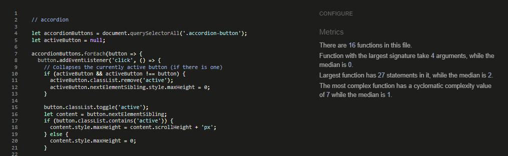
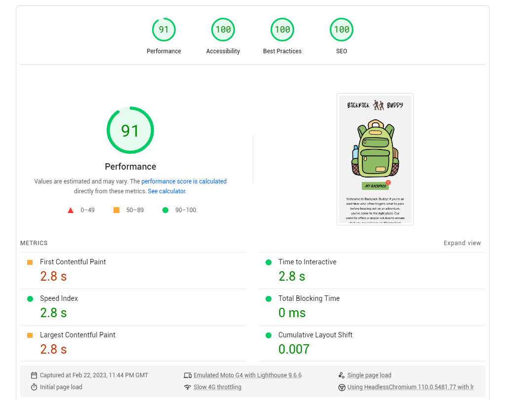
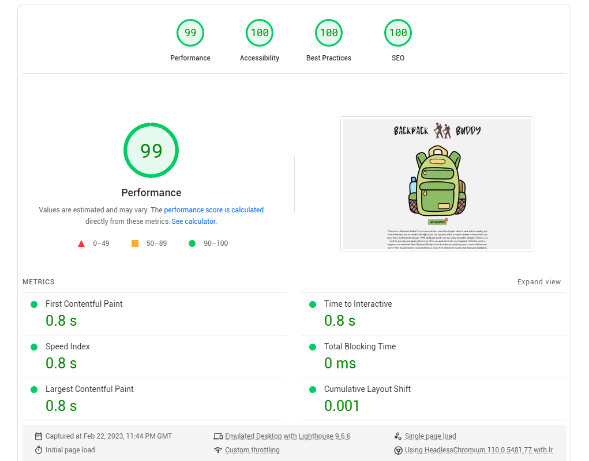

# Testing
## Code Validation
The Backpack Buddy website has been throughly tested. All the code has been run through the [W3C html Validator](https://validator.w3.org/), [W3C CSS Validator](https://jigsaw.w3.org/css-validator/) and the [jsHint JS Validator](https://jshint.com//). No error were found after the last test.

The HTML validator results for each page are below:

* Home page

* 404 page

The CSS validator results are below:

The jsHint validator results are below:

## Responsiveness Test

* The responsive design tests were carried out manually with [Google Chrome DevTools](https://developer.chrome.com/docs/devtools/) and [Responsive Design Checker](https://www.responsivedesignchecker.com/).

|        | Moto G4 | Galaxy S5 | iPhone 5 | iPad | iPad Pro | Display <1200px | Display >1200px |
|--------|---------|-----------|----------|------|----------|-----------------|-----------------|
| Render | pass    | pass      | pass     | pass | pass     | pass            | pass            |
| Images | pass    | pass      | pass     | pass | pass     | pass            | pass            |
| Links  | pass    | pass      | pass     | pass | pass     | pass            | pass            |

Note: On wide display types the contents of the site are restricted in width to 800px. This helps the UX by not spreading the content too wide and making the overal look as an application.

## Browser Compatibility

The website was tested on the following browsers with no visible issues for the user. 
Google Chrome, Microsoft Edge, Safari and Mozilla Firefox. Appearance, functionality and responsiveness were consistent throughout for a range of device sizes and browsers.

## Known Bugs
* ### Resolved

    * While validating index.html for HTML compliance, a bug was discovered. During development stage i overlooked the presence of the "/" symbol at the end of some links, which triggered some warnings. Fortunately, removing the symbols resolved the issue.

    * Another bug was identified, this time involving \
 elements missing closing tags. The problem was quickly resolved by locating the missing tags and closing them.

    * During deployment to GitHub pages, an issue emerged with the loading of assets. Investigation revealed that asset URL links cannot begin with a "/". Fortunately, the fix was simple: removing the "/" from the links.
    
* ### Unresolved

    * When testing the "printBtn" feature, it was discovered that the button was causing 2 pages display, the first one being a Blank Page.

## Additional Testing
### Lighthouse

The site was also tested using [Page Speed Insights](https://pagespeed.web.dev) to test each of the pages for:
* Performance - How the page performs whilst loading.
* Accessibility - Is the site acccessible for all users and how can it be improved.
* Best Practices - Site conforms to industry best practices.
* SEO - Search engine optimisation. Is the site optimised for search engine result rankings.

  ### Mobile

    As an example the results for home page for mobile are below:
    

  ### Desktop
    As an example the results for home page for desktop are below:
    

    

Back to [README.md](./README.md#testing).